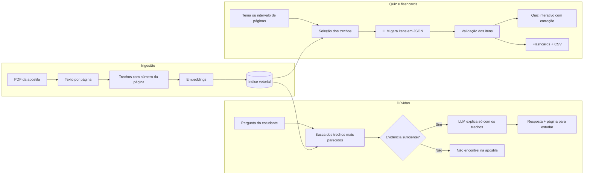

# 🎓 Estudaí — tutor de estudos com IA

Envie a sua apostila em PDF e estude com um tutor que **responde dúvidas**, **cria quizzes** e **gera flashcards**, sempre indicando a **página** de onde saiu cada informação.

> ⚠️ Projeto educacional. As respostas, questões e cartões são gerados por IA e podem conter erros: confira sempre na página indicada da apostila.

---

## 📌 Sobre o projeto

Estudar por apostilas longas em PDF costuma esbarrar em três problemas: **achar a explicação certa** no meio de dezenas de páginas, **fixar o conteúdo** (reler é cômodo, mas testar-se costuma funcionar melhor) e **saber o que revisar** depois de estudar.

O Estudaí ataca os três com uma única base, a própria apostila do estudante:

1. **Tirar dúvidas:** o estudante pergunta em linguagem natural e o tutor explica usando apenas o conteúdo da apostila, indicando onde estudar.
2. **Quiz:** questões de múltipla escolha sobre um tema ou um intervalo de páginas, com correção, explicação e a lista de **páginas para revisar** nas questões erradas.
3. **Flashcards:** cartões de frente e verso para memorização, com exportação em CSV para importar no Anki.

Se a informação não estiver na apostila, o tutor diz isso claramente em vez de inventar uma resposta.

---

## ✨ Funcionalidades

- 💬 Chat de dúvidas com **citação de página** e do trecho consultado
- 🚫 Resposta "não encontrei na apostila" quando a evidência é fraca
- 📝 Quiz com 3 a 10 questões, três níveis de dificuldade, correção imediata e placar
- 🔎 Geração por **tema** (ex.: "meiose") ou por **intervalo de páginas**, ou sorteio da apostila inteira
- 📄 Resumo final do quiz com as páginas que merecem revisão
- 🗂️ Flashcards navegáveis (virar, anterior, próximo) e download em `.csv`
- 📊 Script de avaliação para medir a qualidade da busca

---

## ⚙️ Como funciona



**Passo a passo**

1. O PDF é lido página por página, preservando o número da página.
2. O texto é dividido em trechos pequenos que guardam a página de origem.
3. Cada trecho vira um vetor (embedding) e é salvo em um índice local.
4. **Dúvidas:** a pergunta vira vetor, os trechos mais próximos são recuperados e, se a similaridade passar do limite, o LLM explica usando **somente** esses trechos e cita as páginas.
5. **Quiz e flashcards:** o material vem dos trechos relacionados ao tema, das páginas escolhidas ou de um sorteio da apostila. O LLM devolve os itens em JSON, e o código **valida** cada um antes de mostrá-lo.
6. No quiz, cada resposta errada guarda a página correspondente para a lista de revisão no final.

---

## 🧠 Decisões de projeto

| Decisão | Motivo |
|---|---|
| Guardar a página em cada trecho | Permite citar a fonte e indicar onde revisar |
| Limite mínimo de similaridade | Evita respostas inventadas quando a apostila não cobre o assunto |
| Limite mais brando para temas (`LIMITE_TEMA`) | Temas curtos, como uma palavra, têm similaridade menor que perguntas completas |
| Sorteio de trechos quando não há tema | Cada quiz sai diferente, mesmo sobre a apostila inteira |
| Validação da saída do modelo | Descarta questões com alternativas repetidas, resposta fora do intervalo, página inexistente ou enunciado duplicado |
| Alternativas embaralhadas pelo código | Modelos tendem a repetir a posição da alternativa correta |
| Lista de páginas para revisar | Transforma o erro no quiz em um plano de estudo |
| Estado do quiz e dos cartões por sessão | Vários usuários podem usar o mesmo app sem misturar respostas |
| Embeddings via API (não locais) | Mantém a VM gratuita da nuvem leve, com pouca memória disponível |
| CSV sem cabeçalho | Importa direto no Anki (frente, verso, fonte) |

---

## 🛠️ Tecnologias utilizadas

| Categoria | Tecnologia |
|---|---|
| Linguagem | Python 3.10+ |
| Leitura de PDF | PyMuPDF (mantém o número da página) |
| Modelo de linguagem (LLM) | Google Gemini (modelo Flash, configurável no `.env`) |
| Embeddings | Google Gemini (`gemini-embedding-001`) |
| Índice vetorial | FAISS (local) |
| Interface | Gradio |
| Gerenciamento de variáveis sensíveis | python-dotenv |
| Controle de versão | Git & GitHub |
| Deploy | Oracle Cloud Infrastructure (OCI Compute) com systemd |

---

## ❓ Exemplos de uso

**Apostila usada nos testes:** `<nome da apostila e disciplina>`

> 📝 Os textos abaixo mostram o **formato** das respostas. Substitua os valores entre colchetes pelos resultados reais dos seus testes antes de publicar.

**Dúvida:** [pergunta sobre um conceito da apostila]

**Resposta:** [explicação com base na apostila]. **Onde estudar:** p. [X]

**Dúvida:** [pergunta sobre um assunto que não está na apostila]

**Resposta:** Não encontrei isso na apostila. Tente reformular a pergunta com termos que aparecem no material. *(o tutor reconhece quando o material não cobre o assunto, evitando respostas inventadas)*

**Quiz (formato):**

> **Questão 1 de 5**
> [enunciado]
> A) [alternativa] · B) [alternativa] · C) [alternativa] · D) [alternativa]
>
> ✅ **Correto!** [explicação] *Para revisar: p. [X] da apostila.*

**Flashcard (formato):**

| Frente | Verso | Fonte |
|---|---|---|
| [pergunta ou termo] | [resposta objetiva] | p. [X] |

---

## 📂 Estrutura do projeto

```
estudai/
├── app.py                 # interface (dúvidas, quiz e flashcards)
├── src/
│   ├── config.py          # caminhos, modelos e parâmetros
│   ├── llm.py             # acesso ao Gemini (embeddings e JSON)
│   ├── ingestao.py        # lê o PDF, cria trechos e o índice
│   ├── busca.py           # recupera trechos e aplica o limite de similaridade
│   ├── resposta.py        # responde dúvidas com citação de página
│   ├── material.py        # escolhe os trechos por tema ou intervalo de páginas
│   ├── quiz.py            # gera e valida questões de múltipla escolha
│   ├── flashcards.py      # gera e valida cartões; exporta CSV
│   ├── sessoes.py         # estado do quiz e dos cartões (sem depender da interface)
│   └── prompts.py         # instruções usadas nos prompts
├── data/
│   ├── apostilas/         # PDFs das apostilas (não versionados)
│   ├── index/             # índice gerado pela ingestão (não versionado)
│   └── exports/           # CSV de flashcards (não versionado)
├── avaliacao/
│   ├── perguntas.csv      # perguntas de teste com página esperada
│   └── avaliar.py         # calcula a taxa de acerto da busca
├── deploy/
│   └── estudai.service    # serviço systemd usado na OCI
├── screenshots/           # imagens da demonstração e do deploy
├── requirements.txt
├── .env.example           # modelo do arquivo de variáveis (sem chave real)
├── .gitignore
└── README.md
```

---

## ▶️ Instruções para executar localmente

### Pré-requisitos

- Python 3.10 ou superior instalado
- Uma chave de API gratuita do Google Gemini ([obter aqui](https://aistudio.google.com/apikey))
- Uma apostila em PDF com texto selecionável (não escaneada)

### Passo a passo

```bash
# 1. Clone o repositório
git clone https://github.com/<seu-usuario>/estudai.git
cd estudai

# 2. Crie e ative um ambiente virtual
python -m venv .venv
# Windows:
.\.venv\Scripts\activate
# Linux/Mac:
source .venv/bin/activate

# 3. Instale as dependências
pip install -r requirements.txt

# 4. Configure sua chave de API
cp .env.example .env
# edite o .env e preencha: GOOGLE_API_KEY=sua_chave_aqui

# 5. Processe a apostila (gera o índice vetorial)
python src/ingestao.py data/apostilas/minha_apostila.pdf

# 6. Execute a aplicação
python app.py
```

A aplicação abrirá em `http://localhost:7860`.

**Variáveis opcionais no `.env`**

| Variável | Padrão | Para que serve |
|---|---|---|
| `GEMINI_MODEL` | `gemini-flash-latest` | Modelo usado nas respostas, quizzes e flashcards |
| `LIMITE_SIMILARIDADE` | `0.5` | Similaridade mínima para responder uma dúvida |
| `LIMITE_TEMA` | `0.4` | Similaridade mínima para aceitar um tema no quiz e nos flashcards |
| `TOP_K` | `5` | Quantidade de trechos recuperados por pergunta |
| `PORT` | `7860` | Porta da interface |

Ao trocar de apostila, rode a ingestão novamente e reinicie o app. A nova apostila substitui a anterior.

### Como usar

- **💬 Tirar dúvidas:** escreva a pergunta e pressione Enter.
- **📝 Quiz:** informe um tema **ou** um intervalo de páginas (ou deixe em branco para sortear da apostila inteira), escolha quantidade e dificuldade, clique em **Gerar quiz**, marque a alternativa e clique em **Responder** e depois em **Próxima**.
- **🗂️ Flashcards:** escolha o material do mesmo jeito, clique em **Gerar flashcards**, use **Virar** para ver o verso e baixe o `.csv` para importar no Anki.

---

## 🎥 Demonstração da aplicação


---

## ☁️ Aplicação em produção (Oracle Cloud Infrastructure)

A aplicação está publicada em uma VM (Compute Instance) na OCI, rodando de forma permanente via `systemd`.

🔗 **Acesse a aplicação:** `http://<IP-PUBLICO>:7860`


**Detalhes técnicos do deploy:**

- Instância: `<shape da instância>` (Always Free Tier)
- Sistema operacional: Ubuntu `<versão>`
- Região: `<sua região>`
- A aplicação roda como serviço systemd (`estudai.service`), reiniciando automaticamente em caso de falha

**Como reproduzir o deploy**

1. Crie a instância Compute (Ubuntu) e libere a porta `7860` na *Security List* (ou NSG) da sua VCN.
2. Conecte por SSH, instale Python e clone o repositório.
3. Crie o ambiente virtual, instale as dependências, configure o `.env`, envie a apostila para `data/apostilas/` e rode a ingestão.
4. Libere a porta também no firewall da própria VM:

```bash
sudo iptables -I INPUT -p tcp --dport 7860 -j ACCEPT
sudo netfilter-persistent save
```

5. O `app.py` já escuta em `0.0.0.0`, na porta definida por `PORT` (padrão `7860`).
6. Instale o serviço:

```ini
# deploy/estudai.service
[Unit]
Description=Estudai - tutor de estudos com IA
After=network.target

[Service]
User=ubuntu
WorkingDirectory=/home/ubuntu/estudai
EnvironmentFile=/home/ubuntu/estudai/.env
ExecStart=/home/ubuntu/estudai/.venv/bin/python app.py
Restart=always

[Install]
WantedBy=multi-user.target
```

```bash
sudo cp deploy/estudai.service /etc/systemd/system/
sudo systemctl daemon-reload
sudo systemctl enable --now estudai
sudo systemctl status estudai
```

---

## 📊 Avaliação

Em `avaliacao/perguntas.csv` ficam perguntas de teste no formato `pergunta,pagina_esperada`. Deixe a página vazia nas perguntas cuja resposta **não** está na apostila: elas servem para calibrar o limite de similaridade. O script `python avaliacao/avaliar.py` mede em quantas perguntas a página correta aparece entre os trechos recuperados (taxa de acerto da busca) e sugere uma faixa para `LIMITE_SIMILARIDADE`. Isso permite comparar mudanças, como tamanho dos trechos ou limite de similaridade, com números em vez de impressões.

---

## ⚠️ Limitações

- PDFs escaneados (imagem) precisam de OCR antes do processamento.
- Fórmulas, tabelas e figuras podem perder a formatação, ou nem ser extraídas, na leitura do PDF.
- O número da página é o da posição no PDF, que pode diferir da numeração impressa na apostila.
- Questões e cartões gerados por IA podem conter erros ou ambiguidades; por isso a página é sempre indicada para conferência.
- O app trabalha com **uma apostila por vez**, e o progresso do quiz não é salvo entre sessões.
- Apostilas costumam ter direitos autorais: use materiais seus ou com permissão e não publique PDFs de terceiros no repositório.
- O projeto complementa o estudo, mas não substitui a leitura do material nem o acompanhamento de professores.

---

## 🚀 Próximos passos

- [ ] Suporte a várias apostilas, com escolha da disciplina
- [ ] Repetição espaçada nos flashcards
- [ ] Resumo por capítulo
- [ ] Histórico de desempenho nos quizzes
- [ ] Suporte a arquivos DOCX e PPTX
- [ ] OCR para PDFs escaneados
- [ ] Questões discursivas com correção comentada

---

## 👤 Autor

**Kivia Rayane** — [LinkedIn](https://www.linkedin.com/in/<seu-perfil>) · [GitHub](https://github.com/<seu-usuario>)

Projeto desenvolvido para a trilha ONE (Oracle Next Education) — AI Tech Builder, Alura/Oracle.
